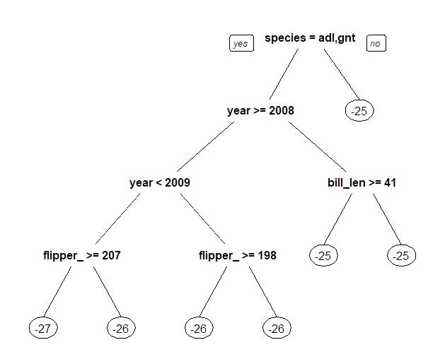

```{r setup, include=FALSE}
knitr::opts_chunk$set(echo = TRUE, warning = FALSE, message = FALSE)
```

## Packages

We're going to explore a data set containing information about penguins observed at Palmer Station, Antarctica. This data set and a lot of exploratory analysis can be found on the [original github repository](https://github.com/allisonhorst/palmerpenguins) and [this paper](https://journals.plos.org/plosone/article?id=10.1371/journal.pone.0090081) describes a lot of modeling work with this data. We'll also be using a lot of the packages from the [*tidyverse*](https://www.tidyverse.org/) and the [*tidymodels*](https://www.tidymodels.org/) meta-packages for data wrangling, preparation, modeling and machine learning. We'll use the *vip* and *fastshap* packages to do some model interpretation as well as couple of other packages that will make our lives easier along the way. Let's load them up. I'll try and use the *package::function* notation whenever we call a function so we can get a good feel for which functions belong to which package. The *package::* part is not not necessary, but it's a good habit to use it especially when different packages contain functions with the same name.

```{r, include = FALSE}
source('./R/install_required_packages.R') #run this line to install the required packages
```

```{r, warning=FALSE, message=FALSE}
library(palmerpenguins) #penguins data
library(tidyverse) #wrangling
library(tidymodels) #modeling and machine learning
library(vip) #variable importance
library(fastshap) #SHapley Additive exPlanations
library(janitor) #cleaning variable names
library(lubridate) #manipulating dates
library(tictoc) #timing computations
library(ggcorrplot) #correlation plots
```

## The Penguins data

Before we get into any machine learning we need to load in some data and see what we're dealing with. It's always a good idea to do some exploratory analysis before jumping into any modeling. We'll load in the *penguins_raw* data set from the *palmerpenguins* package, which contains a bit more information than the standard *penguins* data set.

```{r penguins, echo=TRUE}
penguins_raw <- palmerpenguins::penguins_raw
```

And let's take a glimpse at the two datasets:

```{r}
dplyr::glimpse(penguins_raw)
```
That all seems reasonable. We have 344 penguins and it looks like there's information on their body dimensions, species, region, island, some indication of a date, sex and some isotope ratios which were taken from blood samples. From the *glimpse* we can see if our variables are characters, dates, or numbers. We can also see that we have a few missing values. We're going to clean this dataframe up a little bit to make it easier to work with for exploratory analysis and visualising and then modelling later on. 

```{r}
penguins_prepared <- penguins_raw %>%
  janitor::clean_names() %>%
  dplyr::select(c(species, island, date_egg, culmen_length_mm:delta_13_c_o_oo)) %>%
  dplyr::mutate(species = case_when(species == "Adelie Penguin (Pygoscelis adeliae)" ~ "adelie",
                             species == "Gentoo penguin (Pygoscelis papua)" ~ "gentoo",
                             species == "Chinstrap penguin (Pygoscelis antarctica)" ~ "chinstrap")) %>%
  dplyr::mutate(species = factor(species),
                island = factor(island),
                sex = factor(sex),
                year = lubridate::year(date_egg)) %>%
  dplyr::rename(bill_length_mm = culmen_length_mm,
                bill_depth_mm = culmen_depth_mm,
                delta_15_n = delta_15_n_o_oo,
                delta_13_c = delta_13_c_o_oo) %>%
  tidyr::drop_na()

```
For our machine learning problem it will be fun to try and see if we can accurately predict the ratio of $\delta^{13}$C from the penguin blood samples (our 'delta_13_c' variable) given knowledge about where the penguins come from and some of their body dimensions. There's a lot of other options (e.g. predict species, predict sex, predict body mass, predict island), but these were either too easy or weren't the best example of showing different performances between different types of models. I'm an atmospheric scientist so not an expert, but I believe the $\delta^{13}$C isotope ratio can tell us about the dietary habits of our penguins. Anyway, let's start by just getting a feel for our dataset.

```{r bodies, out.width="100%"}

#Long format is great for summarising and plotting
penguins_prepared_long <- penguins_prepared %>%
  tidyr::pivot_longer(., -c(species, island, date_egg, sex , year), names_to = "variable", values_to = "value")

ggplot(data = penguins_prepared_long %>%
         dplyr::filter(variable == "bill_length_mm" |
                         variable == "bill_depth_mm" |
                         variable == "flipper_length_mm" |
                         variable == "body_mass_g"), 
       aes(x = sex, y = value, fill = species)) +
  geom_violin(draw_quantiles = c(0.25, 0.5, 0.75), width = 0.75) +
  scale_fill_manual(values = c("darkorange","purple","cyan4")) +
  facet_wrap(~variable, scales = "free_y") +
  theme_bw() +
  labs(y = NULL,
       x = "Penguin sex",
       fill = "Penguin species")

```
From this we can see that within species, males generally have larger bodies, bills and flippers. Gentoos are generally larger (except bill depth) and Adelies are the smallest. Let's have a quick look at the blood isotope ratios now:

```{r, echo=FALSE, out.width="100%"}
ggplot(data = penguins_prepared_long %>%
         dplyr::filter(variable == "delta_15_n" |
                         variable == "delta_13_c"), 
       aes(x = sex, y = value, fill = species)) +
  geom_violin(draw_quantiles = c(0.25, 0.5, 0.75), width = 0.75) +
  scale_fill_manual(values = c("darkorange","purple","cyan4")) +
  facet_grid(variable ~ year, scales = "free") +
    theme_bw() +
  labs(y = NULL,
       x = "Penguin sex",
       fill = "Penguin species")
```
Alright, so we can see that Chinstrap penguins have higher ratios of $\delta^{13}$C and $\delta^{15}$N while Gentoo penguins have the lowest. There isn't an obvious difference between females and males. Enough descriptive plots. How well can we predict the $\delta^{13}$C ratio?

## Exploring models types

### Splitting data

With our data set, let's try and come up with a predictive model to predict the $\delta^{13}$C in a number of penguins given we knew their species, sex, region and some of their body dimensions. To do this, we're going to fit a number of models to a subset of our data (i.e. the training set) and then use those models to predict the $\delta^{13}$C ratio on the remainder of our penguins that *we did not use at all to fit our models* (i.e. the testing set). Because in reality we know the $\delta^{13}$C ratio of penguins in our testing set, we can use that *truth* to evaluate our models and decide which ones are worth exploring more. 

First up, let's use the *rsample* package to split our prepared data set into the training and testing sets. We'll use a random 2/3 for training and 1/3 for testing. If wanted to ensure that the proportion of a particular variable is preserved in both sets, you can set the *strata* argurment in the *initial_split* function (e.g. penguin species). By setting a random seed number we can ensure that we randomly split in the same way.

```{r split}
set.seed(222)
penguins_split <- rsample::initial_split(penguins_prepared, prop = 2/3, strata = species)
penguins_train <- rsample::training(penguins_split) #extract the training set from our split
penguins_test <- rsample::testing(penguins_split) #extract the testing set from our split
```

### Defining a workflow

Next up we want to create a *recipe* for our modeling. This *recipe* will contain information on what we want to predict, the variables we're going to use to make out predictions (i.e. *features*), the data set we want to fit our model to, as well as any addition *steps* that we might want to apply to the data before modeling. There are *heaps* of these [steps](https://recipes.tidymodels.org/reference/index.html) (e.g. principal component analysis) you might want to apply to your data prior to modeling. We are going to normalise (i.e. center and scale) our numeric predictors, and we're going to create "dummy" variables for out nominal (categorical) variables (e.g. instead of having a column with species being adelie, chinstrap or gentoo, we'll have a column with a 1 or a 0 indicating if the penguin is chinstrap or not and another column with 1s or 0s indicating if the penguin is chinstrap or not etc). Some algorithms also require this for nominal variables. 

```{r recipe}
penguins_recipe <- recipes::recipe(delta_13_c ~ 
                                     bill_length_mm + bill_depth_mm + flipper_length_mm + body_mass_g + #numeric features
                                     sex + species + year + island, #nominal features (except year..)
                                   data = penguins_train) %>%
  step_normalize(all_numeric_predictors()) %>%
  step_dummy(all_nominal_predictors())
```

Now that we've specified our recipe and steps, we're going to create a *workflow* with the *workflows* package. Note that we still haven't specified what type of algorithm/model we actually want to fit yet, we're just setting everything up so we can specify as many of these as we want later with ease! For now we're just going to add our recipe to our workflow and later we can add our model with *add_model*, but we could easily do this all in one step later if we wanted.

```{r workflow}
penguins_workflow <- workflows::workflow() %>%
  workflows::add_recipe(penguins_recipe)
```

### Model specifications

We have a regression problem on our hand (rather than a classification problem). We're going to use the *parnsip* package to specify a handful of different algorithms that we'll use to build our model. [Here](https://www.tidymodels.org/find/parsnip/) is a list of model types and the underlying packages and engines that are used to run them. Some of these might be familiar to you if you've ever done any modeling in *R*. The beauty of tidymodels is that you can keep using your favourite model type and package, but you can keep a consistent workflow and plug-and-play with all sorts of other models or packages without having to do all the preprocessing again. Because *tidymodels* makes this so easy, you can also get away with knowing very little about how a particular model really works. For our problem here we're going to select a handful of model types that don't require any extra package installations. We'll create a list and add a specification for each model type to this list.

```{r model-types}
model_specifications <- list()

model_specifications$linear_regression_specification <- parsnip::linear_reg() %>%
  set_mode("regression") %>%
  set_engine("lm")

model_specifications$decision_tree_specification <- parsnip::decision_tree() %>%
  set_mode("regression") %>%
  set_engine("rpart")

model_specifications$random_forest_specification <- parsnip::rand_forest() %>%
  set_mode("regression") %>%
  set_engine("ranger", importance = "permutation") #we'll discuss this later.

model_specifications$boosted_tree_specification <- parsnip::boost_tree() %>%
  set_mode("regression") %>%
  set_engine("xgboost")

model_specifications$svm_poly_specification <- parsnip::svm_poly() %>%
  set_mode("regression") %>%
  set_engine("kernlab")

model_specifications$mars_specification <- parsnip::mars() %>%
  set_mode("regression") %>%
  set_engine("earth")
```

For each of the models that we've selected, we're just using the default set-up, but each of them have many options for specifying each of their own *hyperparameters*, which will depend on the model type. If you follow a link for any of the model types on the parsnip website you can see exactly what these hyperparameters are (e.g. *penalty* and *mixture* for [linear regression](https://parsnip.tidymodels.org/reference/linear_reg.html)). In this exercise we will only explore tuning these hyperparameters for the model type that looks most promising based on the default parameters, but in reality you might want to tune the hyperparameters for all the model types you're interested in.

### Fitting our models

Now that we've specified our *recipe* and our model types, we're ready to actually start *fitting* some models to our data. We could do this manually for each model specification, but instead let's write a simple function to do this for *all* of our model types. Our *input* for this function will be a model specification and our *output* will be a fitted model.

```{r define-fit}
fit_my_models <- function(model_specification){
  
  fitted_model <- penguins_workflow %>%
    workflows::add_model(model_specification) %>%
    parsnip::fit(data = penguins_train)
  
  fitted_model
  
}
```

Now that we've defined our function to fit our models, let's go and apply this function to our list of model specifications. To do this we'll use the *map* function from the *purrr* package (part of the *tidyverse*). We could just write out the fitting code for every model specification but that get's old quickly. If you want to run these in parallel (for larger datasets or more models), check out the *furrr* package and accompanying *future_map* function.

```{r do-fit, message=FALSE}
fitted_models <- purrr::map(.x = model_specifications, .f = fit_my_models)
```
With our small data set that only takes a few seconds to run. For larger data sets with many thousands or millions of rows that could be minutes or hours. But now that we have fitted all of our models (these models are stored in our *fitted_models* list), we're ready to actually use them to make predictions. Again, let's write a function that will take our list of fitted models and use these to predict the $\delta^{13}$C for our penguins test set.

```{r predict-test}
predict_with_my_models <- function(fitted_model){
  
  #extract a string with the model engine
  model_engine <- fitted_model$fit$fit$spec$engine %>%
    unlist()
  
  #make our prediction and add it to the test set dataframe
  predicted_test <- predict(fitted_model, new_data = penguins_test) %>%
    dplyr::bind_cols(penguins_test, .) %>%
    dplyr::mutate(engine = model_engine) #adds a column containing the model engine
  
  #output dataframe of the test set with the prediction
  predicted_test
  
}

#Map over list of fitted models, predict and combine into dataframe by rows
predicted_tests <- purrr::map_dfr(fitted_models, predict_with_my_models)
```

This *predicted_tests* dataframe contains all of our predictions for all of our models, just stiched together by row. There is a lot of repeated and redundant information here because we've included all of our predictors. If you're doing this on a larger dataset you might want to exclude the predictors to save on memory. If we have a *glimpse* at this dataframe we'll just see that it's the similar to our test set (just repeated for each model type), but has the addition of the *.pred* column and the *engine* column. Now we're ready to evaluate each model.

```{r}
glimpse(predicted_tests)
```
### Evaluating our models

The reason we added all of our predictions from all of our models into a single dataframe is because it becomes incredibly easy to evaluate all of our models thanks to the *group_by* function from *dplyr*. To do the actually evaluation, we'll use the *metrics* function from the *tidymodels* *yardstick* package. The *metrics* function is fairly smart and will try and identify what type of prediction you've made (e.g. numeric or class) and use some default metrics, but you can also specify [other metrics](https://yardstick.tidymodels.org/articles/metric-types.html) you'd like.

```{r metrics}
predicted_test_metrics <- predicted_tests %>%
  dplyr::group_by(engine) %>%
  yardstick::metrics(., truth = delta_13_c, estimate = .pred)
```

We now have a dataframe containing the metric set for our predictions for each model. Let's visualise this.

```{r plot-metrics, out.width="100%"}
ggplot(data = predicted_test_metrics, aes(x = engine, y = .estimate, colour = engine)) +
  geom_point(size = 3) +
  facet_wrap(~.metric, scales = "free", nrow = 3) +
  theme_bw() +
  scale_color_brewer(palette = "Dark2")
```
Let's also just check the scatterplots to get a better feeling for our predictions.

```{r scatter, out.width="100%"}
ggplot(data = predicted_tests, aes(x = .pred, y = delta_13_c, colour = engine)) +
  geom_point() +
  geom_abline(slope = 1, linetype = 2) +
  facet_wrap(~engine) +
  theme_bw() +
  guides(color = "none") +
  scale_color_brewer(palette = "Dark2")
```

We can see that there is some pretty dramatic differences in performance across our different models. The default *support vector machine* model (with the *kernlab* engine) seemed to have the worst performance with the largest errors and lowest r-squared value, followed closely by our linear regression model (*lm* engine). The three models based on using decision trees (i.e. random forest, single decision tree and XGBoost using the *ranger*, *rpart* and *xgboost* engines, respectively) performed the best using just the default model set ups. This is not always going to be the case, which is why it's important to test different models. For our case, because the random forest model (*ranger* engine) had a pretty good performance, we're going to work with it a bit more and see if we can squeeze some extra performance out of it with some hyperparameter tuning. In reality, *all* of these models can be tuned and just because the default set up of one model type performs worse than another doesn't mean that it is necessarily the sub-optimal choice of model. Some models (e.g. XGBoost) are able to achieve a very good performance in a variety of applications, but are more difficult to tune. Anyway, for our exercise let's just focus on one model type for our tuning.

## Tuning and cross-validation

We're going to focus on using building a random forest model. I like random forests because they generally perform fairly well for both regression and classification problems and are fairly easy to tune. For more information about what they are, check out the [orignal paper](https://link.springer.com/article/10.1023/A:1010933404324) by Leo Breiman. In brief, they are really just a bunch of individual decision trees that are built independently of each other. When used to make predictions, each decision tree will make an independent prediction and the final prediction will be the mean for all predictions (or mode for classification problems). Here's how an individual decision tree might look for our problem:

```{r, echo=FALSE, out.width="100%"}

```

You can imagine growing a number of decision trees that using different variables at each split, with different thresholds for each split, as well as constraining how much you let your tree to continue making more and more splits, as well as fitting your decision tree to different data. A random forest is simply a combination of a number of different decision trees that have different combinations of these variations. So how many trees should our random forest contain? How many variables should we let our tree use to make splits? How deep should we grow our trees? There is no correct answer to this and it *entirely* depends on your data and your objectives. To explore this further we are going to test out a number of different combinations on our training set in what we call hyperparameter tuning. But how will we know which combination gives us the best model performance if we are going to apply our model to a new dataset? We'll do this tuning by further splitting up our training set with cross-validation. Let's start by specifying the model and hyperparameters we want to tune. I found the parameter I wanted to tune by just looking at the [webpage for *rand_forest*](https://parsnip.tidymodels.org/reference/rand_forest.html), and you'll see that they correspond to what we've just been discussing a few sentences ago. If you get to this point with a model it's probably a good idea to get familiar with how the algorithm works, but I think this can be a good starting point in itself rather than reading theory about every single model.

```{r tune-spec}
tune_specification_random_forest <- parsnip::rand_forest(
  trees = 200,
  mtry = tune(),
  min_n = tune()
) %>%
  set_mode("regression") %>%
  set_engine("ranger", importance = "permutation")
```

Let's now create a new *workflow* that will include our tuning procedure, still using the same *recipe* that we defined earlier.

```{r}
tuning_workflow_random_forest <- workflow() %>%
  add_recipe(penguins_recipe) %>%
  add_model(tune_specification_random_forest)
```

Now we're going to specify what combination of hyperparameters we want to explore. We'll do this with the *dials* package using the *grid_regular* function. 

```{r}
hyperparameter_grid_random_forest <- dials::grid_regular(
  mtry(range = c(1,11)),
  min_n(range = c(1,30)),
  #trees(range = c(50, 2000)),
  levels = 3
)

glimpse(hyperparameter_grid_random_forest)
```
We can see that we have 9 different combinations of hyperparameters. You can play around with this by changing the number of levels. Again, there's no right way of going about this. Remember that for every single combination of hyperparameters you'll need to fit a different model, so computational times can get quite long if you try too many. There are different [options](https://dials.tidymodels.org/reference/index.html) for setting up different grids as well (one I like is the grid_latin_hypercube). I also set the number of trees to be 200, but you could also try tuning this as well, although you'll likely find that the performance is not sensitive to the number of trees providing you have *enough* (I have done some testing of this already for you). mtry in this case is the number of features that each split can consider, while *min_n* is the minimum number of samples required for a further split to be made. Some knowledge of your data is good here to know what range to explore. I want to emphasize though that you can apply this tuning procedure for *any* of the model types and just choose different hyperparameters to tune.

Now we want to see which combination of hyperparameters will perform the best. To do that, we're going to using cross-validation with the *vfold_cv* function from the *rsample* package. This is also sometimes called *n-fold cross-validation* or *k-fold cross-validation*. The data is split evenly into *v* number of folds. The model is then trained on *v-1* number of folds and tested on the remaining fold. This whole process is then repeated giving every fold a chance to be the validation set. This whole process can also be repeated any number of times with different splits. It is common for *v* to either be 3, 5 or 10. This is all done due to the fact that the trained model and it's performance will depend on what data goes into the training and testing sets. Cross-validation is an extremely important step in robustly and fairly evaluating the performance of your model and to ensure you are not over or under-fitting. Other methods such as *bootsrapping* (https://rsample.tidymodels.org/reference/bootstraps.html) exist. In this exercise though we will do 3-fold cross validation and repeat the whole process three times.

```{r}
set.seed(222)
penguins_train_folds <- rsample::vfold_cv(penguins_train, v = 3, repeats = 3)
```

Now comes the time consuming part. We're going to build models using every combination of hyperparameter using 3-fold cross-validation and then repeat that whole process three times. We'll do this using the *tune_grid* function from the *tune* package. For this we want to specify our *workflow*, which resamples (i.e. folds) to tune and validate with, our grid of hyperparameters and then (optionally) the metrics we want to collect from all our validations. I've prepared some results already using a much larger number of hyperparameter combinations which we'll load in, but feel free to uncomment the code I used to run it yourself (should take about a minute).

```{r}
# set.seed(333)
# tictoc::tic()
# tuning_results_random_forest <- tune::tune_grid(
#   object = tuning_workflow_random_forest,
#   resamples = penguins_train_folds,
#   grid = hyperparameter_grid_random_forest,
#   metrics = yardstick::metric_set(rsq, rmse)
# )
# tictoc::toc()

#For a much larger number of hyperparameter combinations, run the following:
tuning_results_random_forest <- readRDS('./data/processed/penguins_tuning_results_random_forest_extra.rds')
```
Now let's extract out the metrics from all of our tuning results and do some reshaping of the data to make it easier to plot.

```{r, out.width = "100%"}
collected_metrics_random_forest <- tuning_results_random_forest  %>%
  collect_metrics() %>%
  tidyr::pivot_longer(-c(.metric:.config),
               values_to = "value",
               names_to = "parameter"
  )

ggplot(data = collected_metrics_random_forest, aes(value, mean, color = parameter)) +
  geom_point(show.legend = FALSE) +
  geom_errorbar(data = collected_metrics_random_forest, aes(x = value, 
                                                            ymin = mean - std_err,
                                                            ymax = mean + std_err, 
                                                            color = parameter),
                show.legend = FALSE) + 
  facet_grid(.metric~parameter, scales = "free") +
  labs(x = NULL, y = "estimate") +
  theme_bw() +
  scale_color_brewer(palette = "Set1")
```
This nicely shows how the performance of our models vary with different hyperparameters. The error bars are calculated from standard deviations from our different reruns with different folds from the cross-validation step, but the story is consistent. The *mtry* parameter seems to be the biggest determinant of our model performance, with higher values giving us both a larger r-squared value and lower root-mean-squared error value on our validation sets. It also seems that smaller values of *min_n* also result in a better performance. While we could observe these values and manually select our combination of hyperparameters we want to use, let's automatically select the best based on the *rmse* metric. 

## Model evaluation

We'll then finalize our model specification and fit that to the *entire* training set and again use our fitted model to predict out *penguins_test* testing set.

```{r}
best_rmse <- tune::select_best(tuning_results_random_forest, "rmse")

my_tuned_model_random_forest <- tune::finalize_model(
  tune_specification_random_forest,
  best_rmse
)

my_fitted_model_random_forest <- workflow() %>%
  add_recipe(penguins_recipe) %>%
  add_model(my_tuned_model_random_forest) %>%
  parsnip::fit(penguins_train)

my_predicted_test_random_forest <- predict(my_fitted_model_random_forest, new_data = penguins_test) %>%
  bind_cols(penguins_test, .)
```

Now let's see how well our final model did on our testing set:

```{r}
yardstick::metrics(my_predicted_test_random_forest, truth = delta_13_c, estimate = .pred)

```

Did we make any improvements compared to just the default values from our earlier analysis?

```{r}
yardstick::metrics(predicted_tests %>% filter(engine == "ranger"), truth = delta_13_c, estimate = .pred)
```

Yes! We've achieved lower error values and higher r-squared values thanks to our hyperparameter tuning with cross-validation. Remember that our very initial split of our data set into our training and testing sets was also done randomly, however. If we did this all again but set a different seed number is very likely that these values will again be different. There are many different ways you can go about training, tuning, validating and testing your models. Just keep in mind that it can be *very* easy to overfit a model, so just ensure that you whenever you evaluate and report your modeling performance that this is done on a completely independent testing set. In this example our observations are individual penguins and so randomly splitting some into a training set and others into a testing set is fairly safe. For time series or spatial data, there can potentially be a fair amount of auto-correlation, so it is important to consider that when constructing or specifying your validation or testing sets. *Nested k-fold group cross-validation* would be worth looking into if you think that might apply to your data set and problem.

## Model interpretation

Building a model is not always about making predictions, and even when it is you want to make sure that it is making predictions for the right reasons. Determining how important each of your predictors are deserves a whole session of it's own but we'll quickly have a look at some common tools and I'll mention a new tool that I would encourage everyone to use called SHAP (SHapley Additive exPlanations). Let's use the *vip* package to plot a *variable importance plot* using the *permutation* method (I slipped this into our model specification earlier). 

```{r, out.width = "100%"}
my_fitted_model_random_forest %>%
  extract_fit_parsnip() %>%
  vip::vip() +
  theme_bw()
```
This tells us that two variables seem to be the most important for our prediction of delta-13 C: whether or not the penguin is a Chinstrap or not and what year the data was collected. Let's see if this at least makes sense. Because we applied a few steps in our *recipe*, we want to create a dataframe that applies these steps. We'll do this using the *prep* and *juice* functions from the *recipes*, and then create a correlation plot using *ggcorrplot*.


```{r, out.width = "100%"}
penguins_recipe_juiced <- penguins_recipe %>%
                   recipes::prep() %>%
                   recipes::juice()

ggcorrplot::ggcorrplot(penguins_recipe_juiced %>% 
                         cor() %>%
                         round(., 1),
                       hc.order = TRUE, lab = TRUE)

```
We can see that R = 0.7 between our delta_13_c variable and our species_chinstrap variable in our penguins training data. It is interesting that the correlation between delta_13_c and year is relatively weak, however it is still entirely reasonable that it is one of our most important features because, as we can see from this correlation plot, many of our predictive features are very highly correlated with each other. This also makes interpreting our variable importance plot very dangerous. I've seen a lot of studies use variable importance plots to conclude which predictive features are most important. The problem with many of these however is that a predictive model can still perform very well after removing an apparently "important* feature, simply because it is well correlated with many other features. Furthermore, in our importance plot it is very difficult to know what the "Importance" values *actually* correspond to. Be skeptical when you see variable importance plots and be cautious about drawing quantitative conclusions from any that you produce, especially if your features are correlated. They are still a useful tool for ensuring that your predictive model is behaving as expected if you are familiar with your data. 

### SHapley Additive ExPlanations

Common variable importance tools have many downsides. As stated earlier, the importance value is arbitrary and can change between model types and variable importance techniques. The one we highlighted previously used the *permutation* importance, which randomly shuffles each predictive feature one at a time and looks at how the performance of the model changes (there are different ways of assessing that!). If your predictive features are correlated, you might be creating an "unrealistic" penguin (in the case of our data). We also only get an idea of the *global* importance of each feature, but do not have a good idea of how important each feature was for *each* prediction. There are some tools that address these issues (e.g. ALE or ICE), but here we will focus on a promising new tool called SHAP (SHapley Additive exPlanations). The book [*Interpretable Machine Learning*](https://christophm.github.io/interpretable-ml-book/) by Christoph Molnar is an excellent resource for all of these issues. and I recommend reading the [work]((https://arxiv.org/abs/1705.07874)) by the developers of SHAP, Scott Lundberg and Su-In Lee . 

In short, SHAP values are calculated for every feature for every observation and they tell you how much *knowledge* of each feature changes the *prediction* for every observation. This is done by starting with a *base* prediction (typically the mean) and predicting every observation with all permutation of feature combination exclusions. This is extremely elegant because the units of the SHAP values are the same as whatever you're trying to predict for regression problems (and relates to the change in probability of predictive classes for classification problems). By calculating the mean, median or max SHAp values for each feature over all predictions, you can also get an idea of the *global* importance of each feature *given that your model has a "coalition" of predictive features*. Lastly, you can easily visualise how different values of an individual predictive feature can change your prediction by comparing the individual preditive feature values to their corresponding SHAP values over all predictions.

While not integrated into *tidymodels* and it is much better supported in python, the *fastshap* package in R is a good tool although does require some development and trial and error with coding. The *fastshap* package is *fast* because it approximates the SHAP values by not considering *every* permutation of feature inclusions, but by running a number of simulations you can approach the "exact" SHAP values. The input for the SHAP calculations requires a matrix, so let's produce that:

```{r}
matrix_for_shap <- penguins_recipe %>%
  recipes::prep() %>%
  recipes::juice() %>%
  dplyr::select(-delta_13_c) %>%
  as.matrix()
```

We also need to define something called a prediction wrapper. We also need to specify our fitted model object. This is not overly intuitive and took me some time to figure out unfortunately.

```{r}
pfun <- function(object, newdata) {
  predict(object, data = newdata)$predictions
}

fitted_model_object <- my_fitted_model_random_forest %>%
  extract_fit_parsnip()

```

Now we will use the *explain* function from the *fastshap* package to calculate the SHAP values for our training set and do 100 simulations.

```{r}
tictoc::tic()
shap_n100 <- fastshap::explain(fitted_model_object$fit, 
                             X = matrix_for_shap, 
                             pred_wrapper = pfun, 
                             nsim = 100)
tictoc::toc()
```
This creates a dataframe with the same shape as our training set, where each row corresponds to an observation (i.e. penguin) and each column is the SHAP value for each feature (i.e. how much knowledge of that feature changed out prediction of delta-13 C for that penguin). Let's use the *autoplot* function to visualise the global importance. 

```{r, out.width = "100%"}
autoplot(shap_n100) +
  theme_bw()
```
This is not too different from our default permutation-based variable importance plot from earlier, except we know that these values weren't calculated with "fake" penguins and that the values are in the same units as out delta-13 C variable!. Let's take a look at the SHAP values for the first penguin in our training data set:

```{r, out.width = "100%"}
autoplot(shap_n100, type ="contribution", row_num = 1) +
  theme_bw()
```
By itself this is a bit meaningless (especially for an atmospheric scientist), but the possibilities to really understand your model and your data with this are quite powerful. For example you could aggregate SHAP values for different groups (region, sex, species) or for "good" or "bad" predictions. For one last example, let's look at a dependence plot to see how much flipper length influences our prediction of delta-13 C:

```{r, out.width = "100%"}
autoplot(shap_n100, 
         type = "dependence", 
         feature = "flipper_length_mm", 
         X = penguins_recipe_juiced,
         smooth = TRUE) +
  theme_bw()
```
Remembering that our we normalised our numeric features in our recipe, this tells us that (more precisely: our model predicts that) penguins with longer flippers have slightly lower delta-C 13 ratios. What if we explored this with our original data?

```{r, out.width="100%"}
ggplot(data = penguins_train, aes(x = flipper_length_mm, y = delta_13_c)) +
  geom_point() +
  theme_bw()
```
This also shows us that delta-13 C ratios are somewhat negatively correlated with flipper length, but the range of values in delta-13 C here is much larger than from our SHAP-dependence plot because there are many confounding factors *not* accounted for when we just look at the original data. It is still important to be cautious about interpreting SHAP. When you explore SHAP values you are exploring the relationships between the predictive features and your models' *predictions* and that is only meaningful if you have a *good* predictive model and there is a lot of grey area in what makes a *good* model. 

Hopefully this resource is a good demonstration though on how to go about selecting and building *good* models and introduces some potentially useful tools (e.g. SHAP) for better understanding whatever data set you have that you want to understand better. The code used in this demonstration should hopefully also be fairly re-usable. Aside from defining your original dataset, how you want to split it and specifying a recipe (i.e. what you want to predict and what you want to predict it with) for your model training, tuning and testing to be done, the rest of it should be fairly generalisable to a lot of different problems, which is the purpose of *tidymodels*. Something I haven't done myself but would like to explore in the future is using an *ensemble* of models. Of course, there is also a *tidymodels* package for this called [*stacks*](https://stacks.tidymodels.org/index.html), so check that out if it's something that might be useful for you. 

## Acknowledgements and resources

The developers of the *tidymodels* packages have worked hard to make an incredibly user-friendly, open-source, set of tools to enable people to easily model and apply machine learning. The [tidymodels webpage](https://www.tidymodels.org/) has a lot of great examples and documentation. [Julia Silge](https://juliasilge.com/) is an excellent educator and her blog and video tutorials are very accessible and have been very useful for me in learning how to improve my machine learning code. I recommend checking out what she has to offer. Dale Machete ran an excellent tutorial on mapping in the Southern Ocean in R with [*SOmap*](https://github.com/AustralianAntarcticDivision/SOmap) and I've based a lot of this session on his style. Alex Fraser, Sonya Fiddes and Danielle Udy have listened to me bang on about penguins for a few weeks so I appreciate all of their feedback as well.  


